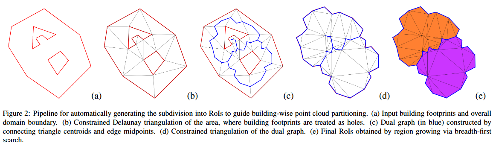

# PBF-FR-partitioning

The identification and recognition of urban features are essential for creating accurate and comprehensive digital representations of cities. In particular, the automatic characterization of fac ̧ade elements plays a key role in enabling semantic enrichment and 3D reconstruction. It also supports urban analysis and underpins various applications, including planning, simulation, and visualization. 

This repository icludes the partitioning approach presented and described in the paper titles *PBF-FR: Partitioning Beyond Footprints for Façade Recognition in Urban Point Clouds*. to appear in Computers \& Graphics - Special Issue 3DOR 2025. 



## Clone
The repository includes the submodules necessary to make the code work. Please, clone it recursively:

- Clone recursively the repository into your local machine:
```
git clone --recursive https://github.com/DanielaCabiddu/PBF-FR-partitioning.git
```

In the following, assume the **${ROOT}** folder to be the one whee this *README* lies.

## Content of the repository
- `src`: source code 
- `external`: external libraries
- `data`: data necessary to replicate experiments described in the paper
- `scripts`: scripts necessary to replicate experiments described in the paper
- `CMakeLists.txt`: build configuration file


## Build the source code
To build the source code, use the following pipeline:

```
cd ${ROOT}
mkdir build
cd build
cmake --DCMAKE_BUILD_TYPE=Release ..
cmake --build . --config Release
```

Binaries will be available in the **${ROOT}/bin** folder

## Author & Copyright
Daniela Cabiddu (CNR-IMATI). Contact Email: daniela.cabiddu@cnr.it

## Citing us
```bibtex
@article{pbf-fr,
  author       = {Chiara Romanengo, Daniela Cabiddu, Michela Mortara},
  title        = {{PBF-FR: Partitioning Beyond Footprints for Façade Recognition in Urban Point Clouds}},
  year         = {2025 (to appear)},
  journal      = {Computers \& Graphics - Special Issue 3DOR 2025}
}
```

## Acknowledgment

This work was partially supported by the project RAISE – Robotics and AI for Socio-economic Empowerment (project code ECS00000035), funded by the European Union – NextGenerationEU and by the Italian Ministry of University and Research (MUR) under the National Recovery and Resilience Plan (NRRP), Mission 4, Component 2, Investment 1.5, Creation and strengthening of innovation ecosystems for sustainability.

The authors also acknowledge support from the project PON METRO – ASSE 1 – Agenda Digitale, titled Urban Intelligence Science Hub (UISH) for City Network (CUP: B51B21000430001), funded under the Italian National Operational Program for Metropolitan Cities 2014–2020.
